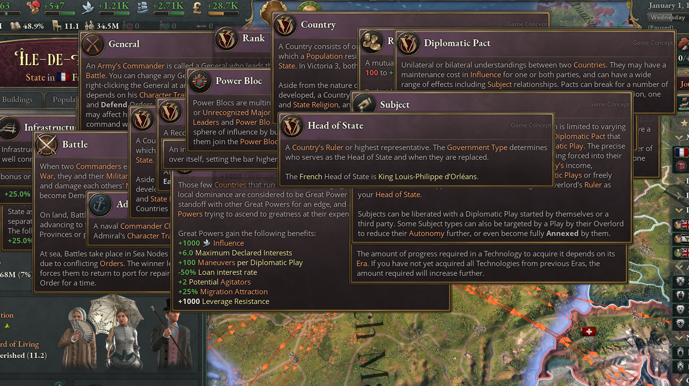

// Created by: Christoph Duzy

## Introduction

A trend in games has been to display more information to the user. In large portion this is due to a desire to impart more, formerly often hidden, information to the user. Take the comparison of Dota vs Dota 2 as an example. Part of it might also be an increased complexity in popular modern games compared to the past.

This presents a problem though: How do you show a large amount of information to the user without overwhelming them, which can often lead to them not absorbing the information at all?

One solution that has emerged in recent times has been nested tooltips. These are a user interface feature that allows players to explore information hierarchically. They start with a primary tooltip that can be 'pinned' or 'locked', enabling users to move their mouse away from the source interaction that opened the tooltip without closing it. Players can then hover over interface elements (normally highlighted text) within the now pinned tooltip to open additional nested tooltips. This nesting can continue potentially indefinitely.

The upside of this is that the user isn't flooded with information, but can slowly discover more information when it is relevant and on demand. It also works incredibly intuitively and doesn't require a significant amount of learning.

Currently this is used in very information-dense genres such as Strategy, Simulation and Role-Playing games where complex and often interacting mechanics are the norm. But because of it's relatively recent introduction and somewhat niche use case there aren't a lot of library or plugin for this. Godot in particular doesn't have one, which is why I want to create one for godot.

### Examples

Nested tooltips are often used in information or simulation heavy games with large amounts of information or many details. The following table is a likely incomplete list of games that have a nesting tooltip system of some sort. Some of these games are picked to show a 

| Game                   | Release Year | Genre          |
| ---------------------- | ------------ | -------------- |
| At the gates           | 2019         | 4X             |
| Crusader Kings 3       | 2019         | Grand Strategy |
| Old World              | 2021         | 4X             |
| Victoria 3             | 2022         | Grand Strategy |
| Total War: Warhammer 3 | 2022         | Strategy       |
| Baldurs Gate 3         | 2023         | RPG            |
| Path of Exile 2        | 2024         | ARPG           |
| Europa Universalis 5   | 2025         | Grand Strategy |
The next subsections are a further examination games that have different, representative implementations of nested tooltips.

#### Path of Exile 2

*Path of Exile 2*'s tooltips are always explicitly pinned by a user interaction (clicking on a link or pressing a keyboard button) and don't close unless explicitly closed by the player. They are moveable when pinned and also allow interactions using a controller.

#### Victoria 3

*Victoria 3* allows the user to pick between three different tooltip behaviours:
- **Mouse Tendency:** Mouse Movement determines if a tooltip stays open.
- **Timer Lock:** Tooltips are pinned after staying open for a certain amount of time.
- **Action Lock:** User defined button press pins tooltip to stay open.
- **Timer or Action Lock:** Allows for both the timer and the user interaction to pin a tooltip.
It also allows customization for how long tooltips take to get pinned and closed. When the 'Timer Lock' setting is used a small UI element on the tooltip shows the progress of time until the pin occurs.
*Crusader Kings 3* and *Europa Universalis 5* from the same company use the same system with minor differences.

#### Total War: Warhammer 3

*Total War: Warhammer 3* introduces a semi-nested tooltip to the franchise, allowing for limited nesting that terminates after around 2-3 nesting depth. Tooltips can be pinned by keeping them open for a time (inclusive) or by clicking a button. These values can be customized in the settings menu. While a tooltip is open a visual 'progress bar' shows the progress of time until the tooltip is locked.